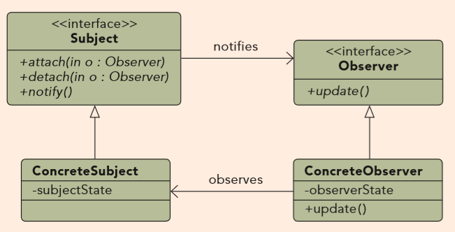
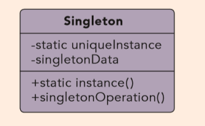

# C# Design Pattern

Includes a number of simple design pattern examples. This is just a cheat sheet for me and by no means a tutorial or similar how to implement certain patterns. I included a short description for each design pattern here.

## Creational Patterns
[Abstract Factory](#abstract-factory)

## Structural Patterns

## Behaviroal Patterns

## Adapter Pattern

When two different system have for example a product with width and height. But in one system the product has a ";" separated string WidthHeight combined and in the other system the width and height are separate float fields. With help of the adapter pattern we can create a common interface for both of the products.

## Abstract Factory

Helps for example when you have to edit multiple formats (HTML, plain text). With Abstract Factory we can ensure that the apporiate object sets are created based upon the style of the text. Helps to easily add or remove formats, it helps to ensure a higher level of seperation

## Bridge Pattern

Its a composite of the Template and Strategy Pattern. At first sight, the Bridge pattern looks a lot like the Adapter pattern in that a class is used to convert one kind of interface to another. However, the intent of the Adapter pattern is to make one or more classes' interfaces look the same as that of a particular class. The Bridge pattern is designed to separate a class's interface from its implementation so you can vary or replace the implementation without changing the client code.

## Builder Pattern

Helps to create new object by offering a range of different builders to create new objects. For example could a file transfer builder be created and if you want to use FTP you can use the FTP builder. 

## Command Pattern

Used to handle queing- and callback-requests through objects. With the command pattern you can check if a action is already processed or not. Example: Store a bunch of transactions and only process them at a time you want.   

## Composite Pattern

Helps to map a hirarchy into objects. Example: If you want to create a employee hirarchy with CEO, Manager, Employe. 

## Decorator Pattern

Allows to wrap objects to modify their behavior. A NPC can have different beahviours, they can also be mixed. A merchant can have be sad or ill or both. Instead of making three different subclasses for all states we just make two (ill, sad) and combine them via the pattern.

## Facade Pattern

Packs many interfaces to a single one. Via the single interface you can access the complex system behind it. 

## Factory Method Pattern

Helps to create objects without having to specify the exact class of the object that will be created. Instead of calling constructors a factory method is called 

## Null-Object Pattern

Solves the problem of null objects and how to handle them. With the pattern you dont need to check if a object is null.

## Observer Pattern

Objects can get notified if the state in another object is changed within the system. Oftly used in GUI environment. Applications listen to clicked buttons etc. Each button click throws an event and all observers get notified.

## Singleton Pattern

Used when you need to be sure that only one instance of an object exists.

## State Pattern

Kina close to strategy pattern but enables to change behavior depending on which state the program currently is. If you have a vending machine and want to buy something then you can have states like choosing, paid, dispense. After you chose an item the state changes to "Chosen" after you paid changes to "Paid" etc.

## Strategy Pattern

Instead of making alot of if else or switch statments you can use a strategy pattern to carry out specific behavior.

## Visitor Pattern

Allows for one or more operations to be applied to a set of objects at runtime, decoupling the operations from the object structure.
